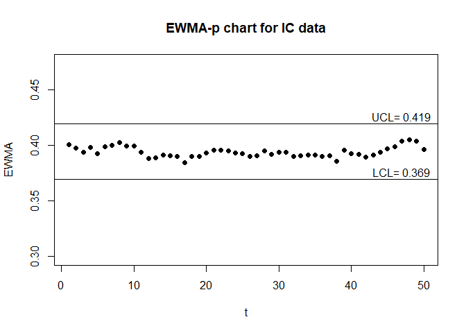
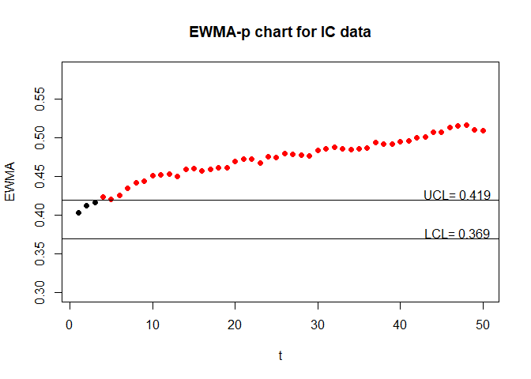
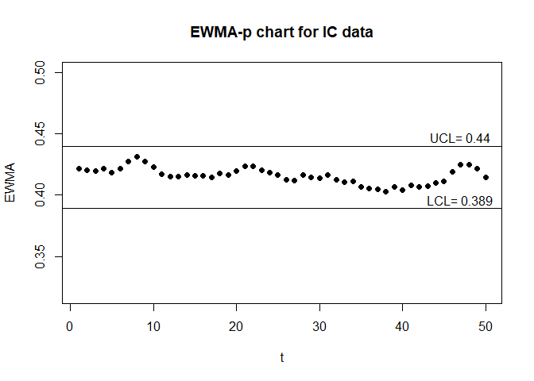
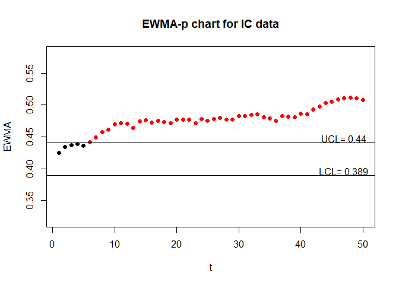
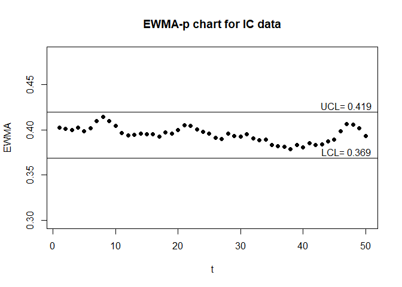
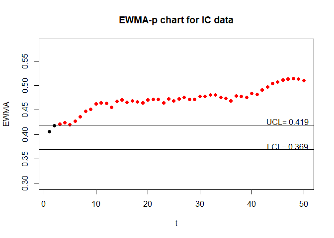

<!-- README.md is generated from README.Rmd. Please edit that file -->

# EATME

<!-- badges: start -->
<!-- badges: end -->

## Overview

The statistical quality control tool aims to address measurement error
effects when constructing exponentially weighted moving average p
control charts. The method primarily focuses on binary random variables,
but it can be applied to any continuous random variables by using sign
statistic to transform them to discrete ones. With the correction of
measurement error effects, we can obtain the corrected control limits of
exponentially weighted moving average p control chart and reasonably
adjusted exponentially weighted moving average p control charts.

## Installation

You can install the released version of EATME from
[github](https://github.com/Kuan-cheng-da/EATME)

``` r
install.packages('EATME')
library(EATME)
```

## Examples

This is an example which shows how find the control limits for two sided
EWMA-p chart:

``` r
library(EATME)
#0.2 is the in-control probability
#0.05 is the smoothing parameter for EWMA chart
#5 is sample size
#1 is the correctness of true and false
#200 is ARL0
#10000 is the number of simulation for Monte Carlo method
#1 is the maximum error what we can allow between hat_ARL0 and ARL0
EWMA_p_two(0.2,0.05,5,1,1,200,10000,1)
#> $L1
#> [1] 2.319918
#> 
#> $L2
#> [1] 2.223654
#> 
#> $hat_ARL0
#> [1] 199.339
#> 
#> $hat_MRL
#> [1] 131
#> 
#> $hat_SDRL
#> [1] 210.7766
#> 
#> $UCL
#> [1] 0.2664531
#> 
#> $LCL
#> [1] 0.1363043
```

This is an example which shows how plot the two sided adjusted EWMA-p
chart :

``` r
set.seed(6)
#We generate the discrete IC data with measurement error.
IC = ME_data_generate(0.4,50,50,0.9,0.9)
#We generate the discrete IC data with measurement error.
OC = ME_data_generate(0.5,50,50,0.9,0.9)
#The real EWMA-p chart
EWMA_p_chart_two(IC$real_data,OC$real_data,0.05,50,1,1)
```



``` r
#The unadjusted EWMA-p chart
EWMA_p_chart_two(IC$obs_data,OC$obs_data,0.05,50,1,1)
```



``` r
#The adjusted EWMA-p chart
EWMA_p_chart_two(IC$obs_data,OC$obs_data,0.05,50,0.9,0.9)
```


